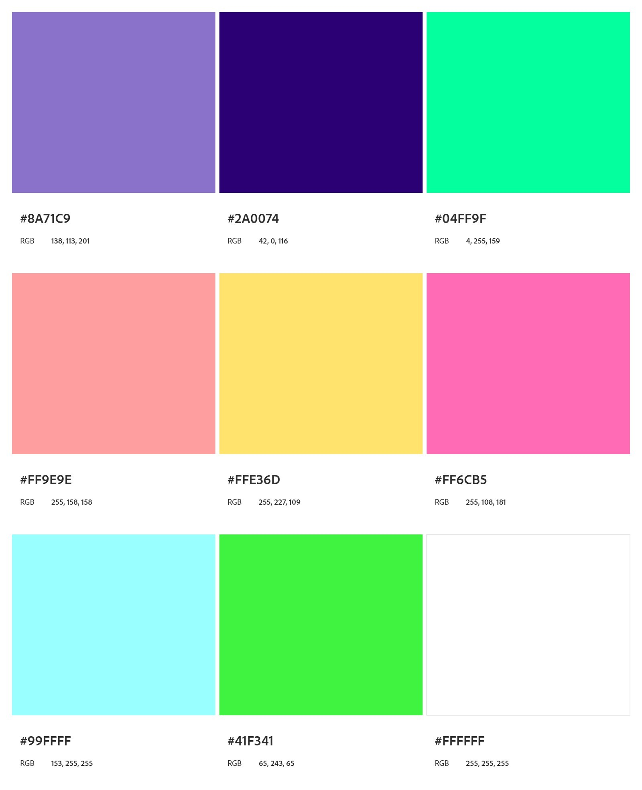

# Site Ada Lovelace

## Proposta
O curso "Eu Programo" propôs um desafio: criar um site sobre Ada Lovelace, que é conhecida por seu trabalho pioneiro na programação de computadores, especialmente por ter escrito o primeiro algoritmo destinado a ser processado por uma máquina, o que a torna uma figura fundamental para nós, programadores.
## Ferramentas Utilizadas

## Paleta de Cores
Elas foram selecionadas pela equipe do curso

## Imagens

/i.s3.glbimg.com/v1/AUTH_08fbf48bc0524877943fe86e43087e7a/internal_photos/bs/2021/n/3/FbrmyhQneVYWGUPIe8vA/adalovelace.jpg)

